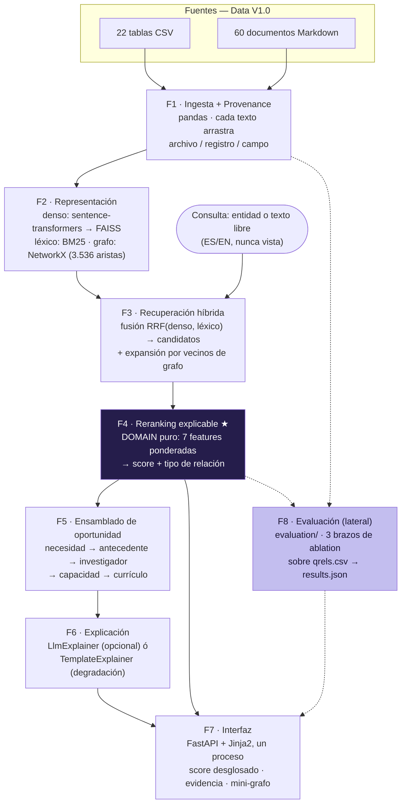

# KNexus Engine — Knowledge Nexus LATAM

> Solución técnica al reto **Knowledge Nexus LATAM: Conectar el conocimiento** (hackathon internacional
> nivel avanzado). Convierte información institucional fragmentada — necesidades, proyectos, tesis,
> investigadores, capacidades, currículo — en conexiones **priorizadas, explicables y trazables**.

## 1. Qué es

La universidad ficticia del reto tiene información abundante pero dispersa entre 22 tablas y 60
documentos. La pregunta central no es *"¿qué información existe?"* sino **"¿cómo se conecta, qué
oportunidad surge de esa conexión, y cómo se demuestra que tiene fundamento?"**

El examen que gobierna todo el diseño: **similarity ≠ relevance**. Dos registros pueden compartir
vocabulario y aun así no ser pertinentes; el sistema nunca rankea por coseno puro — descompone cada
conexión en **7 features auditables**, tipa la relación, y deja el "por qué" navegable hasta el
archivo/registro/campo que lo sustenta.

KNexus Engine responde en vivo a: un ID de entidad del dataset (`NEED-001`, `PRJ-004`...), o texto libre
en español o inglés — sin resultados precargados.

## 2. Diagrama de arquitectura

Pipeline (Pipes & Filters) gobernado por Arquitectura Hexagonal (dominio puro, dependencias siempre
hacia adentro). Corresponde exactamente a lo implementado.



`F8` corre offline (`scripts/evaluate.py`) y precomputa `evaluation/results.json`; la interfaz sólo lo
lee (`/metrics`) — 20 NEEDs con el modelo real no caben en el tiempo de un request HTTP.

**Flujo de uso (interfaz web):** todas las páginas salvo `/` (Descubrir) mantienen una barra de
búsqueda persistente en el header — se puede lanzar una consulta nueva desde resultados, conexión,
oportunidad o auditoría sin volver al inicio. El mini-grafo de `/connection/{id}` es interactivo:
arrastrable nodo por nodo, zoom con la rueda, paneo del fondo, y cada nodo enlaza a su propia página
de conexión (las etiquetas ya no se truncan, se envuelven en varias líneas). Un glosario desplegable
("Cómo leer esto") explica los 7 factores del score sin jerga técnica, y cada tarjeta de resultado
muestra siempre en texto los 3 factores dominantes (no depende de hover, por accesibilidad). Las
páginas de oportunidad y auditoría sin consulta ofrecen ejemplos (`quick picks`) en vez de un
callejón sin salida.

## 3. Tecnologías

| Capa | Tecnología |
|---|---|
| Embeddings | `sentence-transformers` (`paraphrase-multilingual-MiniLM-L12-v2`) |
| Índice denso | `faiss-cpu` (fallback exacto en NumPy si falta) |
| Índice léxico | `rank-bm25` |
| Grafo | `networkx` |
| Fusión / reranking | código propio (RRF + 7 features ponderadas, `src/domain/`) |
| Backend + UI | FastAPI + Jinja2, un solo proceso |
| LLM opcional | OpenRouter (`anthropic/claude-3.5-haiku` por defecto), degrada sin key |

Declaración completa de componentes externos, versiones y cómo se distingue evidencia institucional de
contenido generado: **[`docs/DECLARACION_TECNOLOGICA.md`](docs/DECLARACION_TECNOLOGICA.md)**.

## 4. Instalación y ejecución

Requiere Python 3.11+ (probado con 3.12).

```bash
cd knexus
python -m venv .venv
# Windows: si sentence-transformers/torch falla por MAX_PATH, usar una ruta
# corta para el venv, p.ej. `python -m venv C:\kvenv` (ver §9, Limitaciones).
.venv\Scripts\activate        # Windows
# source .venv/bin/activate   # macOS/Linux

pip install -r requirements.txt
```

**Arrancar la interfaz web** (desde `knexus/`):

```bash
uvicorn src.interface.app:app --reload
# abrir http://127.0.0.1:8000
```

- `KNEXUS_FAST=1 uvicorn src.interface.app:app` — modo rápido con `HashingProvider` (sin descargar el
  modelo real ni similitud semántica real; útil para probar la interfaz sin red).
- Primer arranque sin `--fast`: descarga el modelo (~470 MB) desde Hugging Face Hub una sola vez;
  arranques siguientes son offline.
- macOS: si `faiss` + `torch` abortan con `SIGABRT`/"OMP: Error #15" al cargar juntos, es un conflicto
  conocido de runtimes OpenMP entre ambas librerías nativas — ya mitigado en el código
  (`KMP_DUPLICATE_LIB_OK=TRUE`); no requiere acción manual.
- LLM opcional: `export OPENROUTER_API_KEY=...` para redacción vía API real (OpenRouter, sin SDK
  adicional — usa `httpx`); sin esto, el sistema funciona completo con `TemplateExplainer` (Regla A4).

**CLI de consulta manual** (sin levantar el servidor):

```bash
python scripts/query_cli.py "NEED-001"
python scripts/query_cli.py "student attrition prediction" --top 10
python scripts/query_cli.py "PRJ-004" --compare PRJ-002
python scripts/query_cli.py "NEED-001" --opportunity
python scripts/query_cli.py "NEED-001" --fast   # offline, HashingProvider
```

**Correr los tests:**

```bash
pytest -m "not slow"     # 166 tests, sin red, ~1 min
pytest -m slow            # 8 tests con el modelo real
pytest                     # los 174
```

## 5. Reproducir la demostración

Tres casos ejecutados con el modelo real y documentados con su salida literal:
**[`docs/CASOS_DEMOSTRABLES.md`](docs/CASOS_DEMOSTRABLES.md)**.

| Caso | Consulta | Qué demuestra |
|---|---|---|
| A | `NEED-001` | Antecedente + comparador exacto "¿por qué A antes que B?" |
| B | `NEED-009` | Cadena de oportunidad completa (investigación→investigador→capacidad→currículo) en un segundo dominio |
| C | Texto libre en inglés, nunca visto | Consulta nueva en vivo, cruzando idioma, sin precargados |

Cada uno es navegable también en la interfaz: `/results?q=NEED-001`, `/opportunity?q=NEED-009`, etc.

## 6. Mecanismo de descubrimiento y valoración

1. **Recuperación híbrida** (RRF sobre denso+léxico) genera candidatos — **nunca decide el orden final**,
   sólo garantiza recall amplio. El pool se expande además con vecinos de grafo de los candidatos
   fuertes (un investigador rara vez comparte vocabulario textual con una necesidad; "lo trae la
   arista, no el texto").
2. **Reranking explicable** (`src/domain/scoring.py`): 7 features ponderadas —
   `compat_metodo` (0.20), `compat_dominio` (0.20), `sim_semantica` (0.18), `soporte_capacidad` (0.15),
   `densidad_evidencia` (0.12), `enlace_estructural` (0.10), `sim_lexica` (0.05, el peso más bajo a
   propósito — evita premiar la trampa léxica). El score es la suma ponderada; una feature sin señal
   real (p.ej. un NEED no declara método) se marca **N/A y se re-normaliza el resto de los pesos** —
   nunca se rellena con un 0 falso.
3. **Tipo de relación** (`relation_type.py`): clasifica cada conexión (`antecedente_metodologico`,
   `activacion_capacidad`, `coincidencia_superficial`...) — el score solo no basta, hay que decir *qué*
   significa la conexión.
4. **Ensamblado de oportunidad** (`domain/opportunity.py`): cada eslabón de la cadena declara su
   `link_type` (`retrieved`/`edge`/`inferred`) — un dato recuperado, una arista real de una tabla de
   relación y una inferencia por regla nunca se presentan como si fueran la misma clase de evidencia. Un
   eslabón sin evidencia real simplemente no aparece; nunca se fabrica.
5. **Explicación** (`Explainer`, puerto): redacción en lenguaje natural con grounding estricto para
   conexión, oportunidad y el comparador A-vs-B de `/audit` (`explain_comparison`) — verificado por
   test que ningún ID/cifra en la salida puede faltar en el input.

## 7. Evidencia de desempeño

Medición real (2026-08-27, `paraphrase-multilingual-MiniLM-L12-v2`, 2.512 entidades, 20 NEEDs
etiquetados por cluster de `application_context`, `evaluation/results.json`). Metodología completa y
sesgos declarados: código fuente de la medición en `knexus/evaluation/harness.py` y
`knexus/evaluation/qrels.py`. Pantalla interactiva: `/metrics`.

| Brazo | P@5 | P@10 | R@30 | MRR |
|---|---|---|---|---|
| `full` (pipeline real) | 0.480 | 0.505 | 0.490 | 0.621 |
| `cosine` (mismo pool, orden por coseno) | 0.540 | 0.570 | 0.498 | 0.611 |
| `dense` (coseno puro, sin RRF/grafo/reranking) | 0.540 | 0.570 | 0.502 | 0.611 |

**Resultado medido tal cual, sin ajustar nada para que se vea mejor:** P@5 del pipeline real es MÁS BAJO
que el de los brazos de similitud pura. La causa, verificada en el mismo run: la etiqueta de relevancia
(`application_context`) es **temática**, y favorece estructuralmente al coseno. La métrica que sí
muestra el valor del reranking es *construct validity* sobre el top-5:

| Brazo | `actionable_rate` | `trap_rate` |
|---|---|---|
| `full` | **0.55** | **0.28** |
| `cosine` / `dense` | 0.27 | 0.65 |

El pipeline real duplica la tasa de conexiones con valor de decisión directo y reduce a menos de la
mitad las coincidencias superficiales — el argumento *"similarity ≠ relevance"* queda demostrado con
datos, no ilustrado con un ejemplo elegido a mano.

## 8. Limitaciones conocidas

- El set etiquetado (`evaluation/qrels.csv`) cubre 20 de los 42 NEEDs — los 22 restantes
  (`NEED-021..042`) son necesidades meta-institucionales sin candidato temático real y quedan fuera a
  propósito (verificado en la auditoría de Sprint-07, hay un test que impide etiquetarlos).
- `sim_lexica` es constante 0 para todo NEED — `institutional_needs.csv` no tiene columna `keywords`.
  Es una limitación de diseño declarada (pesa sólo 0.05 a propósito), no un bug oculto.
- `LlmExplainer` (redacción vía OpenRouter) **no fue probado contra la API real** en este entorno
  — no había key disponible durante el desarrollo. Está cubierto por tests unitarios con cliente falso;
  la llamada de red real queda sin verificar. El sistema funciona completo sin él.
- Los techos de recall son estructurales, no un límite del sistema: con clusters de 21-34 entidades
  relevantes sobre un top-30, R@30 no puede superar ~0.97-1.0 — se reporta siempre junto al número.
- Dataset sintético (`dataset/README.md`): las entidades y relaciones son ficticias, generadas para el
  reto — ninguna conclusión aquí generaliza a una universidad real sin re-validación.
- `faiss-cpu` usa búsqueda exacta (`IndexFlatIP`), no aproximada — válido a esta escala (~2.500
  entidades); no se probó el comportamiento a escalas mayores.

## 9. Checklist de la guía oficial (§11)

| Pregunta | Respuesta |
|---|---|
| ¿Procesa realmente Data V1.0? | Sí — `src/adapters/repository/`, 2.512 entidades + 3.536 aristas cargadas con provenance. |
| ¿Conexión no trivial entre fuentes distintas? | Sí — Caso A (`docs/CASOS_DEMOSTRABLES.md`), necesidad↔proyecto. |
| ¿Explica por qué una conexión es relevante y otra no? | Sí — `/audit`, comparador con delta exacto por feature (Caso A). |
| ¿Mecanismo de priorización? | Sí — §6 de este README, `src/domain/scoring.py`. |
| ¿Llega desde la recomendación hasta el archivo/registro/campo? | Sí — Regla A3, `tests/interface/test_trazabilidad_ui.py`. |
| ¿Las oportunidades se derivan de evidencia institucional? | Sí — cada `ChainLink` con `link_type`, ADR-012; nada se fabrica. |
| ¿Conexiones con investigación, capacidades y/o currículo? | Sí — Caso B, cadena completa. |
| ¿Funciona end-to-end con consulta nueva? | Sí — Caso C, texto libre nunca visto. |
| ¿La arquitectura corresponde a lo implementado? | Sí — diagrama §2 verificado contra el código en Sprint-08 (antes decía `bge-m3`; corregido). |
| ¿El README permite ejecutar la solución? | Este documento, §4. |
| ¿Se declaran modelos, APIs y componentes externos? | `docs/DECLARACION_TECNOLOGICA.md`. |
| ¿Se explican limitaciones sin afirmar de más? | §8 de este README. |

## 10. Estructura del repositorio

```
dataset/          Data V1.0 (fuente de verdad, sin sobrescribir)
docs/               Entregables de empaque: declaración tecnológica, casos demostrables, guion de pitch
knexus/               Código fuente ejecutable — ver src/, tests/, evaluation/, scripts/
```
